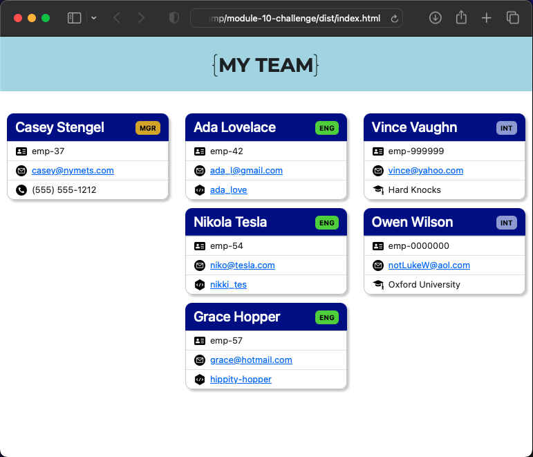
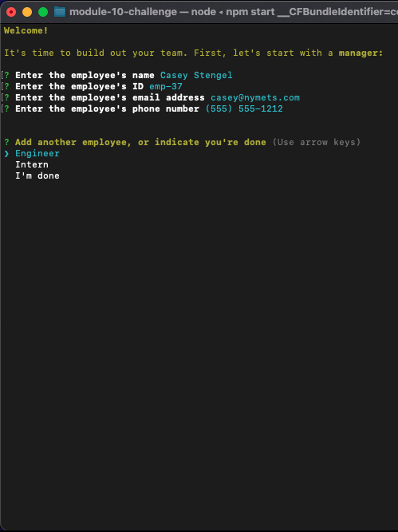

# Development Team Builder 

## Description

The Development Team Builder is a CLI application that accepts input from the user about employees on their development team, and outputs an HTML file with that information arranged in an org-chart-type layout.

## Table of Contents

* [Installation Instructions](#installation-instructions)
* [Usage Information](#usage-information)
* [Application Features](#application-features)
* [Credits](#credits)
* [Software License](#software-license)
* [Contact the Developer](#questions)

## Installation Instructions

The Development Team Builder runs on Node.js. This version was developed and tested on version 18.13.0. It has two dependencies, both third-party modules available through npmjs: email-validator (v. 2.0.4) and inquirer (v. 8.2.4). The output file is best read in any web browser.

## Usage Information

To use the Development Team Builder, within Node.js run the index.js file at the top level of the application's directory.

The user is first asked to enter the information of the Manager (name, employee id, email and phone). Subsequently (and as many times as the user likes), they are asked if they would like to enter another employee: either an Engineer (name, employee id, email and GitHub id) or an Intern (name, employee id, email and school). The third option is to indicate that they are done entering employees.

There is some validation as the user enters the information:
* Employee id's must be unique
* Email addresses must be of proper format: with an @ and a proper domain extension
* Phone numbers must be at least seven digits

Once the user has indicated they are done, the Development Team Builder generates a file, `./dist/index.html`, which the user can view in any Web browser. Re-running the application overwrites this file.

Here is a [video walkthrough](https://drive.google.com/file/d/1VLi8YvojMX5QrqChyq7Zivtxi2LwzCJP/view?usp=sharing) of the application in action.

## Application Features

* Prompted guidance through the application
* Automatic generation of an HTML file with layout applied
* Validation of employer id, email address format and phone number length
* Automatically created `mailto` links for email addresses
* Automatically created links to engineers' GitHub profiles
* Responsive design

## Credits

The Develpment Team Builder would not be possible without the creators and contributors to the Node.js project, as well as the Inquirer and Email-validator modules. Nor would it have been possible without the guidance of the University of Minnesota Full Stack Coding Bootcamp instructional and tutorial staff.

Further guidance came from the wisdom of coders around the Web, most particluarly from [Stack Overflow](https://www.stackoverflow.com), the [Mozilla Developer Network](https://developer.mozilla.org) and [W3Schools](https://www.w3schools.com), among others.

## Software License

©2023, Lee Klusky

This software is covered by a [MIT License](https://opensource.org/licenses/MIT).

Permission is hereby granted, free of charge, to any person obtaining a copy of this software and associated documentation files (the "Software"), to deal in the Software without restriction, including without limitation the rights to use, copy, modify, merge, publish, distribute, sublicense, and/or sell copies of the Software, and to permit persons to whom the Software is furnished to do so, subject to the following conditions:

The above copyright notice and this permission notice shall be included in all copies or substantial portions of the Software.

THE SOFTWARE IS PROVIDED "AS IS", WITHOUT WARRANTY OF ANY KIND, EXPRESS OR IMPLIED, INCLUDING BUT NOT LIMITED TO THE WARRANTIES OF MERCHANTABILITY, FITNESS FOR A PARTICULAR PURPOSE AND NONINFRINGEMENT. IN NO EVENT SHALL THE AUTHORS OR COPYRIGHT HOLDERS BE LIABLE FOR ANY CLAIM, DAMAGES OR OTHER LIABILITY, WHETHER IN AN ACTION OF CONTRACT, TORT OR OTHERWISE, ARISING FROM, OUT OF OR IN CONNECTION WITH THE SOFTWARE OR THE USE OR OTHER DEALINGS IN THE SOFTWARE.

## Questions?

Contact me at <a href="mailto:lkbootcamp@yahoo.com">lkbootcamp@yahoo.com</a>, or visit my [GitHub profile](https://www.github.com/lkalliance).